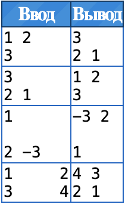
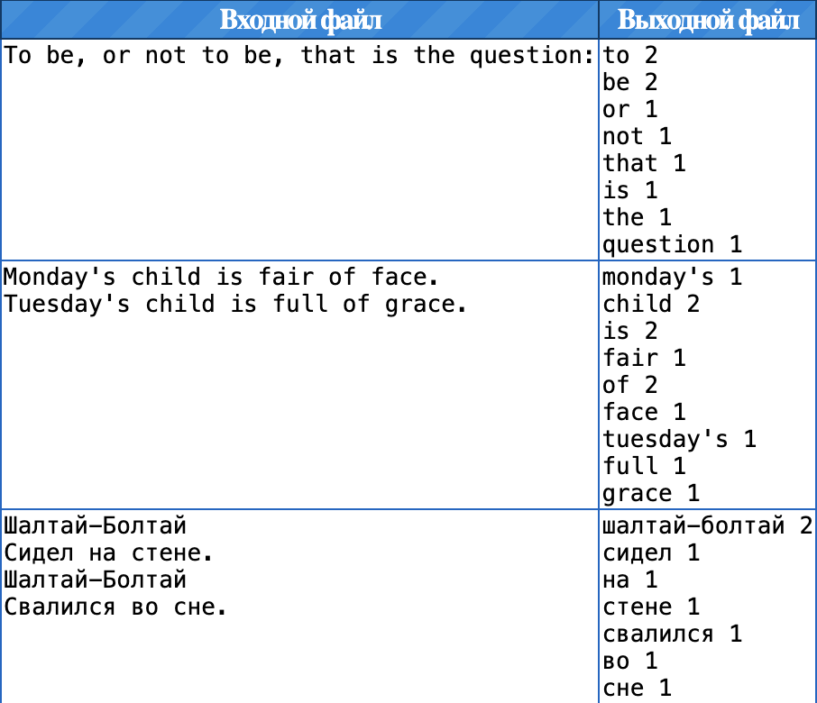
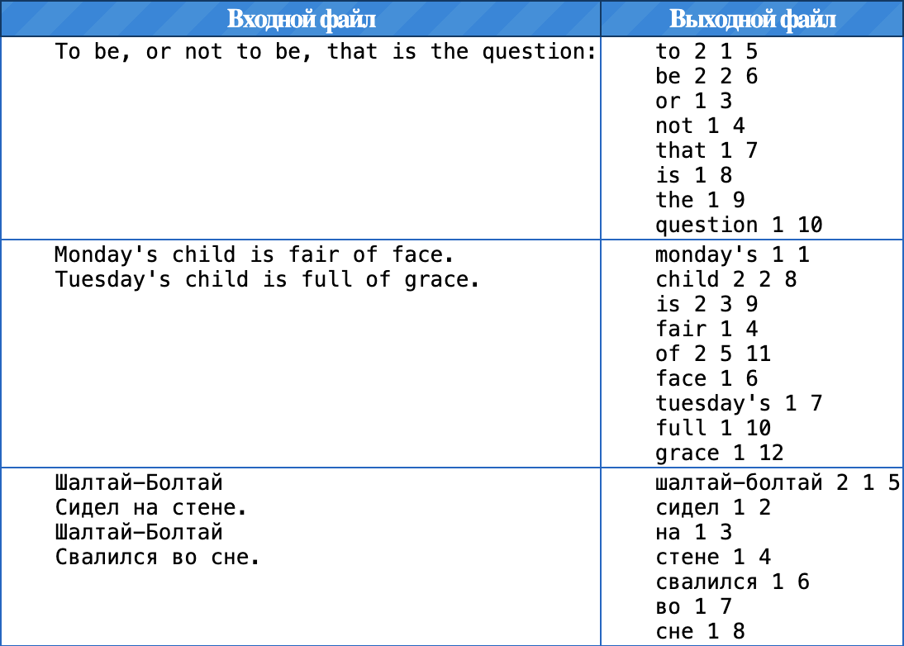

# prog-intro

## Домашнее задание 1. Hello World 

Установите JDK 17+. 
Скопируйте один из вариантов HelloWorld, рассмотренных на практике. 
Откомпилируйте HelloWorld.java и получите HelloWorld.class. 
Запустите HelloWorld и проверьте его работоспособность. 
Создайте скрипт, компилирующий и запускающий HelloWorld из командной строки. 

## Домашнее задание 2. Сумма чисел 
Разработайте класс Sum, который при запуске из командной строки будет складывать переданные в качестве аргументов целые числа и выводить их сумму на консоль. 
Примеры запуска программы: 
java Sum 1 2 3 
Результат: 6 
java Sum 1 2 -3 
Результат: 0 
java Sum "1 2 3" 
Результат: 6 
java Sum "1 2" " 3" 
Результат: 6 
java Sum " " 
Результат: 0 
Аргументы могут содержать: 
цифры; 
знаки + и -; 
произвольные пробельные символы. 
При выполнении задания можно считать, что для представления входных данных и промежуточных результатов достаточен тип int. 
Перед выполнением задания ознакомьтесь с документацией к классам String и Integer. 
Для отладочного вывода используйте System.err, тогда он будет игнорироваться проверяющей программой. 

## Домашнее задание 3. Реверс 
Разработайте класс Reverse, читающий числа из стандартного ввода и выводящий их на стандартный вывод в обратном порядке. 
В каждой строке входа содержится некоторое количество целых чисел (возможно ноль). Числа разделены пробелами. Каждое число помещается в тип int. 
Порядок строк в выходе должен быть обратным по сравнению с порядком строк во входе. Порядок чисел в каждой строке также должен быть обратным к порядку чисел во входе. 
Вход содержит не более 10⁶ чисел и строк. 
Для чтения чисел используйте класс Scanner. 

## Домашнее задание 4. Статистика слов 
Разработайте класс WordStatInput, подсчитывающий статистику встречаемости слов во входном файле. 
Словом называется непрерывная последовательность букв, апострофов (') и дефисов (Unicode category Punctuation, Dash). Для подсчета статистики слова приводятся к нижнему регистру.
Выходной файл должен содержать все различные слова, встречающиеся во входном файле, в порядке их появления. Для каждого слова должна быть выведена одна строка, содержащая слово и число его вхождений во входном файле. 
Имена входного и выходного файла задаются в качестве аргументов командной строки. Кодировка файлов: UTF-8. 
Чтение должно быть реализовано в блочном режиме с использованием Reader. 
Примеры работы программы: 

## Домашнее задание 5. Свой сканер 
Реализуйте свой аналог класса Scanner на основе Reader. 
Примените разработанный Scanner для решения задания «Реверс». 
Примените разработанный Scanner для решения задания «Статистика слов». 
Нужно использовать блочное чтение. Код, управляющий чтением, должен быть общим. 
Сложный вариант. Код, выделяющий числа и слова, должен быть общим. 
Обратите внимание на: 
Обработку ошибок. 
Модификаторы доступа. 
Слова и числа, пересекающие границы блоков, особенно — больше одного раза. 

## Домашнее задание 6. Статистика слов++ 
Разработайте класс Wspp, который будет подсчитывать статистику встречаемости слов во входном файле.
Словом называется непрерывная последовательность букв, апострофов (') и дефисов (Unicode category Punctuation, Dash). Для подсчета статистики слова приводятся к нижнему регистру. 
Выходной файл должен содержать все различные слова, встречающиеся во входном файле, в порядке их появления. Для каждого слова должна быть выведена одна строка, содержащая слово, число его вхождений во входной файл и номера вхождений этого слова среди всех слов во входном файле. 
Имена входного и выходного файла задаются в качестве аргументов командной строки. Кодировка файлов: UTF-8. 
Программа должна работать за линейное от размера входного файла время. 
Для реализации программы используйте Collections Framework. 
Примеры работы программы: 

Домашнее задание 7. Разметка 
Разработайте набор классов для текстовой разметки. 
Класс Paragraph может содержать произвольное число других элементов разметки и текстовых элементов. 
Класс Text – текстовый элемент. 
Классы разметки Emphasis, Strong, Strikeout – выделение, сильное выделение и зачеркивание. Элементы разметки могут содержать произвольное число других элементов разметки и текстовых элементов. 
Все классы должны реализовывать метод toMarkdown(StringBuilder), который должен генерировать Markdown-разметку по следующим правилам: 
текстовые элементы выводятся как есть; 
выделенный текст окружается символами '*'; 
сильно выделенный текст окружается символами '__'; 
зачеркнутый текст окружается символами '~'. 
Следующий код должен успешно компилироваться: 
    Paragraph paragraph = new Paragraph(List.of( 
        new Strong(List.of( 
            new Text("1"), 
            new Strikeout(List.of( 
                new Text("2"), 
                new Emphasis(List.of( 
                    new Text("3"), 
                    new Text("4") 
                )), 
                new Text("5") 
            )), 
            new Text("6") 
        )) 
    )); 
Вызов paragraph.toMarkdown(new StringBuilder()) должен заполнять переданный StringBuilder следующим содержимым: 
    __1~2*34*5~6__ 
Разработанные классы должны находиться в пакете markup. 

## Домашнее задание 8. Git 
Загрузите решения домашних заданий (в том числе сданных) в ваш персональный git-репозиторий. Со следующей недели сдача домашних заданий будет производиться только через репозитории. 

Персональные репозитории являются клонами этого репозитория. В нём вы можете ознакомиться с правилами ведения репозитория и рекомендациями по его настройке. 

## Домашнее задание 9. Markdown to HTML 
Разработайте конвертер из Markdown-разметки в HTML. 
Конвертер должен поддерживать следующие возможности: 
Абзацы текста разделяются пустыми строками. 
Элементы строчной разметки: выделение (* или _), сильное выделение (** или __), зачеркивание (--), код (`) 
Заголовки (# * уровень заголовка) 
Конвертер должен называться md2html.Md2Html и принимать два аргумента: название входного файла с Markdown-разметкой и название выходного файла с HTML-разметкой. Оба файла должны иметь кодировку UTF-8. 
При выполнении этого ДЗ можно повторно использовать код ДЗ markup. 
Конвертер может хранить исходные и сконвертированные данные в памяти, в том числе одновременно. 
Пример 
Входной файл 
# Заголовок первого уровня

## Второго

### Третьего ## уровня

#### Четвертого
# Все еще четвертого

Этот абзац текста
содержит две строки.

    # Может показаться, что это заголовок.
Но нет, это абзац, начинающийся с `#`.

#И это не заголовок.

###### Заголовки могут быть многострочными
(и с пропуском заголовков предыдущих уровней)

Мы все любим *выделять* текст _разными_ способами.
**Сильное выделение**, используется гораздо реже,
но __почему бы и нет__?
Немного --зачеркивания-- еще никому не вредило.
Код представляется элементом `code`.

Обратите внимание, как экранируются специальные
HTML-символы, такие как `<`, `>` и `&`.

Знаете ли вы, что в Markdown, одиночные * и _
не означают выделение?
Они так же могут быть заэкранированы
при помощи обратного слэша: \*.

Лишние пустые строки должны игнорироваться.

Любите ли вы *вложенные __выделения__* так,
как __--люблю--__ их я?
            
Выходной файл
<h1>Заголовок первого уровня</h1>
<h2>Второго</h2>
<h3>Третьего ## уровня</h3>
<h4>Четвертого
# Все еще четвертого</h4>

Этот абзац текста
содержит две строки.

    # Может показаться, что это заголовок.
Но нет, это абзац, начинающийся с <code>#</code>.

#И это не заголовок.

<h6>Заголовки могут быть многострочными
(и с пропуском заголовков предыдущих уровней)</h6>

Мы все любим <em>выделять</em> текст <em>разными</em> способами.
<strong>Сильное выделение</strong>, используется гораздо реже,
но <strong>почему бы и нет</strong>?
Немного <s>зачеркивания</s> еще никому не вредило.
Код представляется элементом <code>code</code>.

Обратите внимание, как экранируются специальные
HTML-символы, такие как <code>&lt;</code>, <code>&gt;</code> и <code>&amp;</code>.

Знаете ли вы, что в Markdown, одиночные * и _
не означают выделение?
Они так же могут быть заэкранированы
при помощи обратного слэша: *.

Лишние пустые строки должны игнорироваться.

Любите ли вы <em>вложенные <strong>выделения</strong></em> так,
как <strong><s>люблю</s></strong> их я?

            
Реальная разметка
Заголовок первого уровня
Второго
Третьего ## уровня
Четвертого # Все еще четвертого
Этот абзац текста содержит две строки.

# Может показаться, что это заголовок. Но нет, это абзац, начинающийся с #.

#И это не заголовок. 

Заголовки могут быть многострочными (и с пропуском заголовков предыдущих уровней) 
Мы все любим выделять текст разными способами. Сильное выделение, используется гораздо реже, но почему бы и нет? Немного зачеркивания еще никому не вредило. Код представляется элементом code. 

Обратите внимание, как экранируются специальные HTML-символы, такие как <, > и &. 

Знаете ли вы, что в Markdown, одиночные * и _ не означают выделение? Они так же могут быть заэкранированы при помощи обратного слэша: *. 

Лишние пустые строки должны игнорироваться. 

Любите ли вы вложенные выделения так, как люблю их я? 

## Домашнее задание 10. Чемпионат 
Решите как можно больше задач Чемпионата северо-запада России по программированию 2019. 
Материалы соревнования: 
PCMS: Java. North-Western Russia Regional Contest - 2019 
Условия задач 
Разбор задач 
Задачи для решения 
Задача	Тема	Сложность 
A.	Accurate Movement	Формула	5 
B.	Bad Treap	Циклы	10 
C.	Cross-Stitch	Графы	40 
D.	Double Palindrome	Массивы	40 
E.	Equidistant	Деревья	30 
H.	High Load Database	Массивы	20 
I.	Ideal Pyramid	Циклы	15 
J.	Just the Last Digit	Матрицы	20 
K.	King’s Children	Массивы	40 
M.	Managing Difficulties	Коллекции	10 

## Домашнее задание 11. Игра m,n,k 
В этом домашнем задании вы можете пользоваться кодом, написанным на лекции. Он есть на сайте курса. 

Реализуйте игру m,n,k (k в ряд на доске m×n). 
Добавьте обработку ошибок ввода пользователя. В случае ошибочного хода пользователь должен иметь возможность сделать другой ход. 
Добавьте обработку ошибок игроков. В случае ошибки игрок автоматически проигрывает. 
Простая версия. Доска может производить обработку хода за O(nmk). 

## Домашнее задание 12. Выражения 
Разработайте классы Const, Variable, Add, Subtract, Multiply, Divide для вычисления выражений с одной переменной в типе int (интерфейс Expression). 
Классы должны позволять составлять выражения вида 
new Subtract(
    new Multiply(
        new Const(2),
        new Variable("x")
    ),
    new Const(3)
).evaluate(5)
            
При вычислении такого выражения вместо каждой переменной подставляется значение, переданное в качестве параметра методу evaluate. Таким образом, результатом вычисления приведенного примера должно стать число 7. 
Метод toString должен выдавать запись выражения в полноскобочной форме. Например 
new Subtract(
    new Multiply(
        new Const(2),
        new Variable("x")
    ),
    new Const(3)
).toString()
            
должен выдавать ((2 * x) - 3). 
Сложный вариант. Метод toMiniString (интерфейс ToMiniString) должен выдавать выражение с минимальным числом скобок. Например 
new Subtract(
    new Multiply(
        new Const(2),
        new Variable("x")
    ),
    new Const(3)
).toMiniString()
            
должен выдавать 2 * x - 3. 
Реализуйте метод equals, проверяющий, что два выражения совпадают. Например, 
new Multiply(new Const(2), new Variable("x")) 
    .equals(new Multiply(new Const(2), new Variable("x"))) 
            
должно выдавать true, а 
new Multiply(new Const(2), new Variable("x")) 
    .equals(new Multiply(new Variable("x"), new Const(2))) 
            
должно выдавать false. 
Для тестирования программы должен быть создан класс Main, который вычисляет значение выражения x2−2x+1, для x, заданного в командной строке. 
При выполнении задания следует обратить внимание на: 
Выделение общего интерфейса создаваемых классов. 
Выделение абстрактного базового класса для бинарных операций. 

## Домашнее задание 13. Разбор выражений 
Доработайте предыдущее домашнее задание так, чтобы выражение строилось по записи вида 
x * (x - 2)*x + 1 
В записи выражения могут встречаться: 
бинарные операции: умножение *, деление /, сложение + и вычитание -; 
унарный минус -; 
переменные x, y и z; 
целочисленные константы в десятичной системе счисления, помещающиеся в 32-битный знаковый целочисленный тип; 
круглые скобки для явного обозначения приоритета операций; 
произвольное число пробельных символов в любом месте, не влияющем на однозначность понимания формулы (например, между операцией и переменной, но не внутри констант). 
Приоритет операций, начиная с наивысшего 
унарный минус; 
умножение и деление; 
сложение и вычитание. 
Разбор выражений рекомендуется производить методом рекурсивного спуска. 
Алгоритм должен работать за линейное время. 
Лексический анализ (токенизация) не требуется. 

## Домашнее задание 14. Обработка ошибок 
Добавьте в программу, вычисляющую выражения, обработку ошибок, в том числе: 
ошибки разбора выражений; 
ошибки вычисления выражений. 
Для выражения 1000000*x*x*x*x*x/(x-1) вывод программы должен иметь следующий вид: 
x       f 
0       0 
1       division by zero 
2       32000000 
3       121500000 
4       341333333 
5       overflow 
6       overflow 
7       overflow 
8       overflow 
9       overflow 
10      overflow 
            
Результат division by zero (overflow) означает, что в процессе вычисления произошло деление на ноль (переполнение). 
При выполнении задания следует обратить внимание на дизайн и обработку исключений. 
Человеко-читаемые сообщения об ошибках должны выводиться на консоль. 
Программа не должна «вылетать» с исключениями (как стандартными, так и добавленными). 
